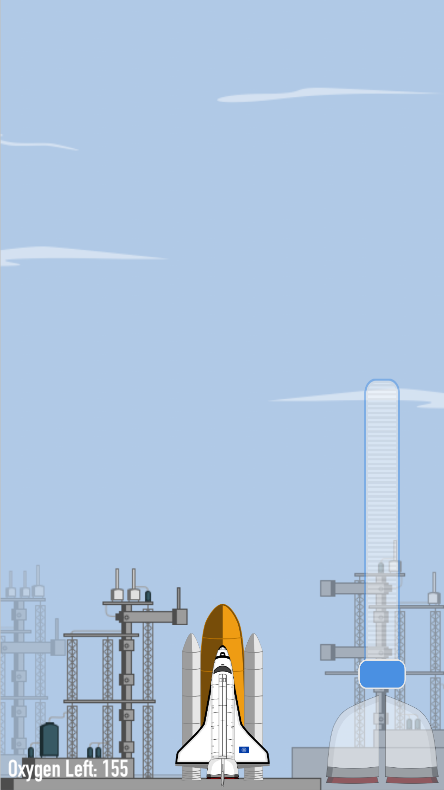
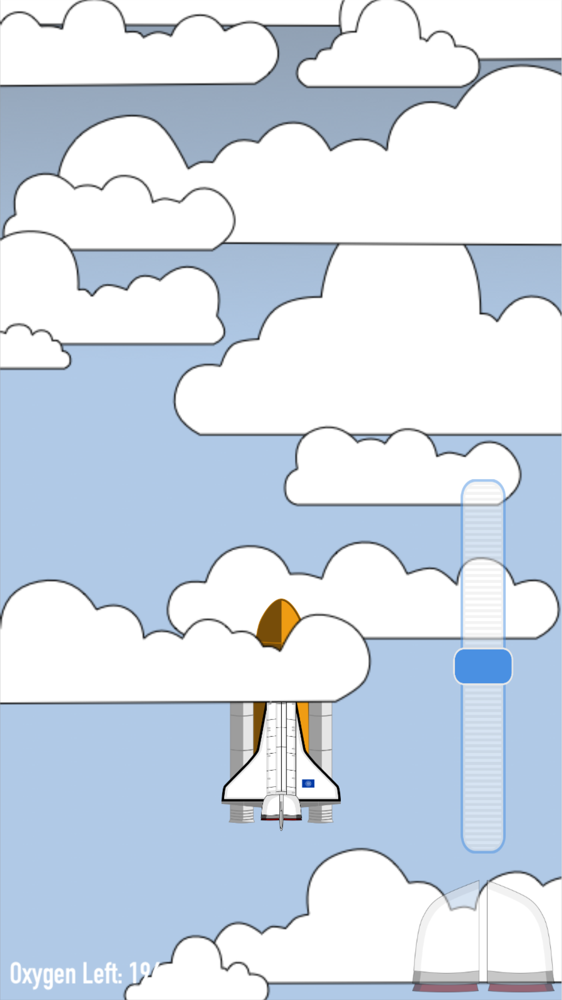
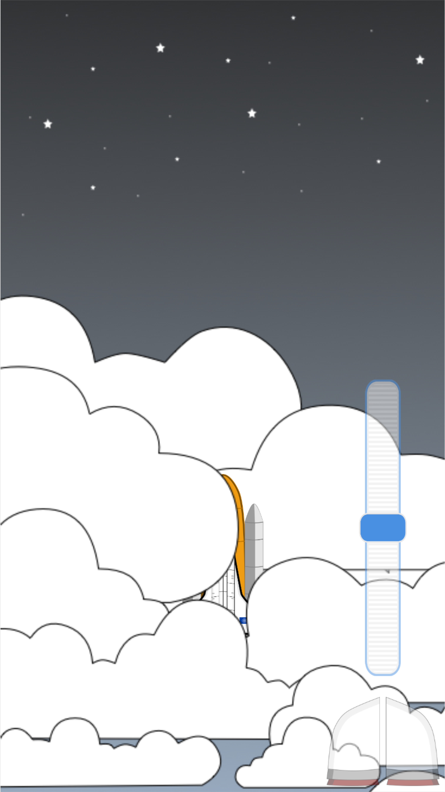
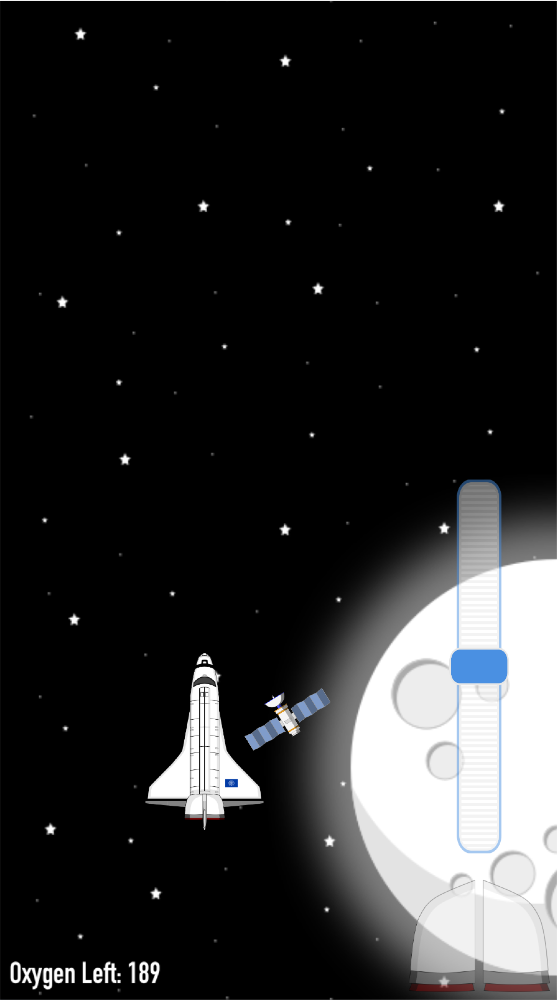
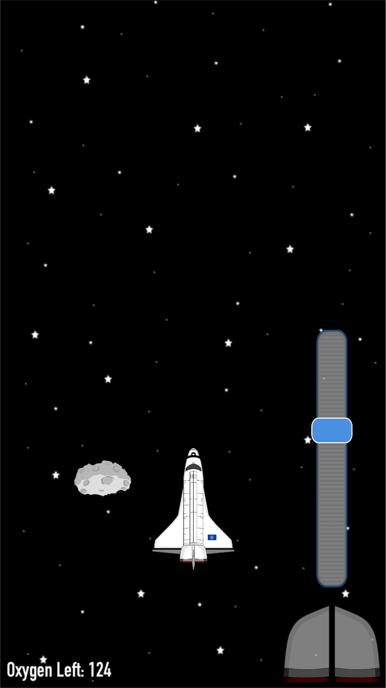
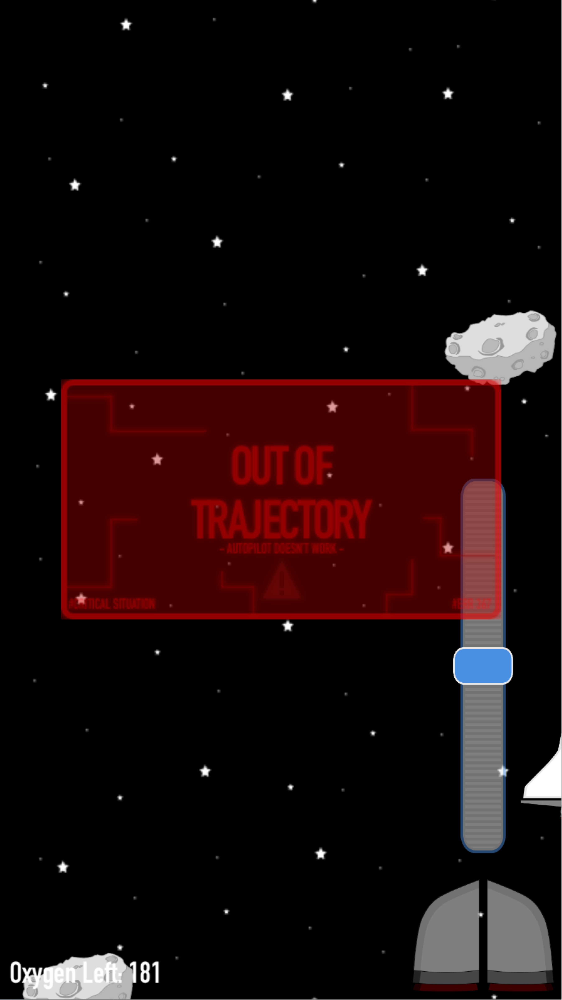
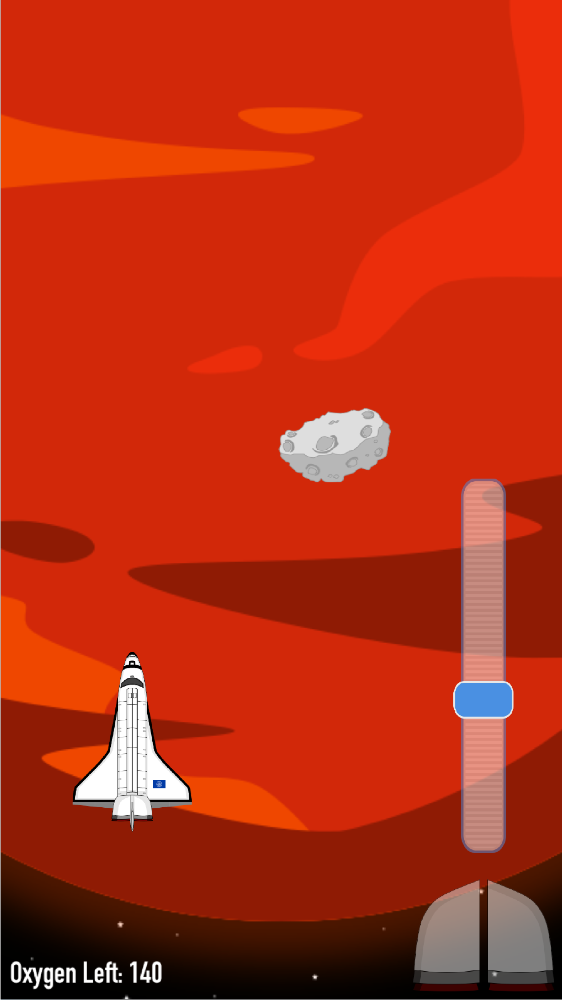

# A-Trip-into-the-Space
Welcome to my submission for the WWDC 2018 Scholarship! It's a very simple game made using SpriteKit.

**Description**

_Space_... what we know about it? A lot and at same time nothing.
 
 After the "space race" has started, humanity has pointed a lot in this topic to try to send humans in space and to learn informationa about things that are distant hundreds of light years and that, hopefully, we will reach sooner or later.
 
 
 This playgound is basically a game where you pilot a space shuttle and you mission is to reach Mars, the Red Planet!
 The trip is very dangerous and you will meet a lot of difficulties like satellites and asteroids. Moreover you need to stay in the right trajectory of course, or you trip will become longer that expected (going into the deep space is not funny ;) )
 
 Different obstacles will bring to different "game over" types that will try to teach you some curiosity about the universe and how spaceman and scientists work together!
 
 
**Screenshots**

 
 
 

